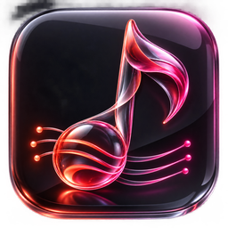
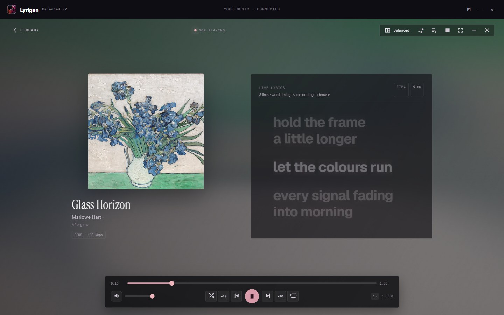
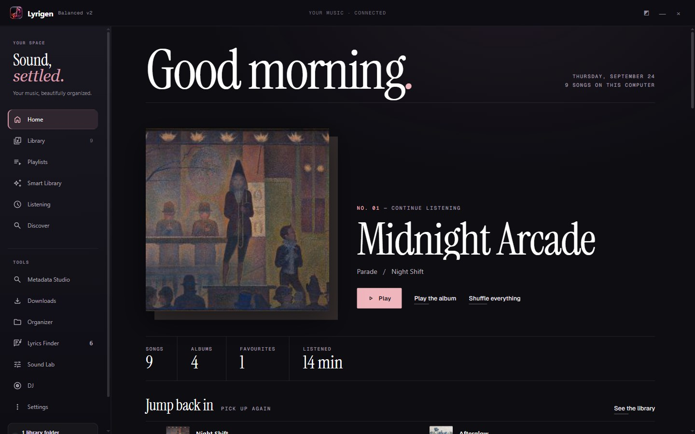
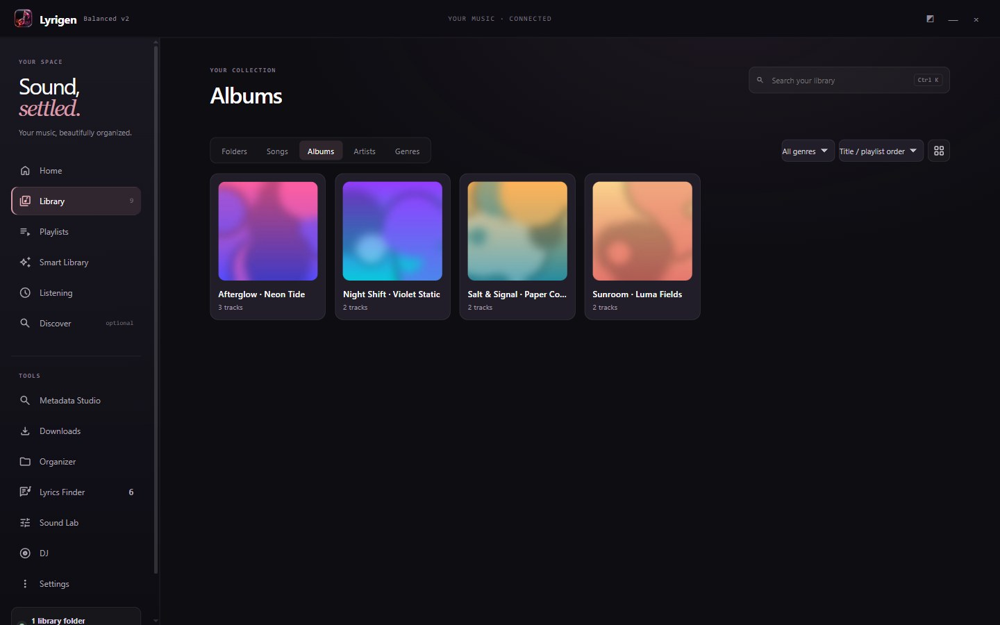
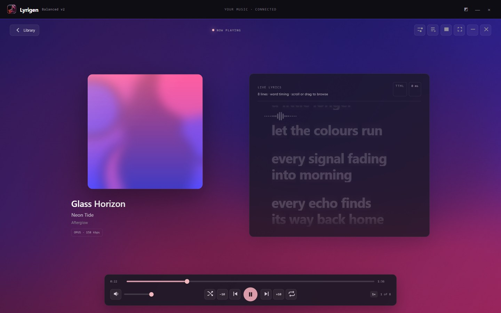
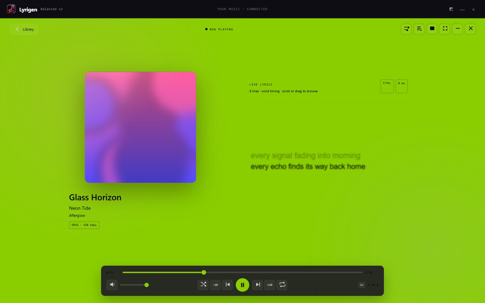
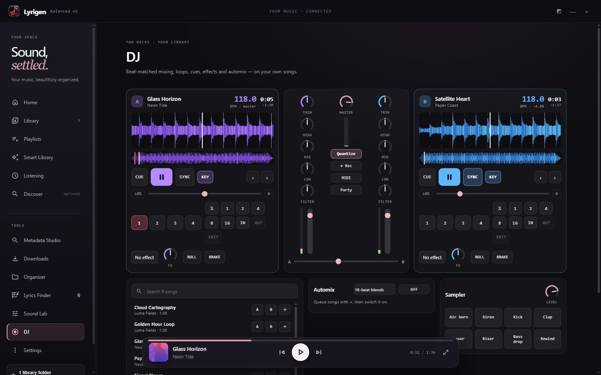
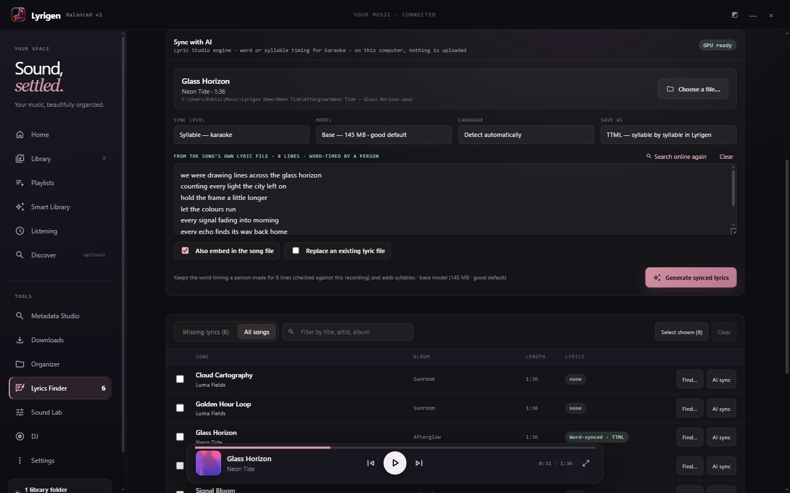

<div align="center">



# Lyrigen

**A free, local-first music player for Windows — with word-by-word lyrics, karaoke-grade syllable sync, a DJ mode and liquid visuals.**

Your music, on your computer. No account, no subscription, no telemetry.

[](https://github.com/mufaddalhirani/lyrigen/releases/latest)
&nbsp;
[](https://github.com/mufaddalhirani/lyrics-studio)

[](https://github.com/mufaddalhirani/lyrigen/releases/latest)




</div>

---

## Highlights

<table>
<tr>
<td width="50%"><br /><b>Home</b> — pick up where you left off, shelves built from what you actually play.</td>
<td width="50%"><br /><b>Library</b> — folders, songs, albums, artists and genres; opens instantly, even with thousands of songs.</td>
</tr>
<tr>
<td><br /><b>Live lyrics</b> — word- and syllable-timed; a small visualizer plays in instrumental breaks.</td>
<td><br /><b>brat mode</b> — lime green, each word flies in from alternate sides as it is sung.</td>
</tr>
<tr>
<td><br /><b>DJ</b> — two decks with automatic BPM, beat sync, loops, hot cues, effects, sampler and automix.</td>
<td><br /><b>AI lyric sync</b> — time any song word by word or syllable by syllable, on your own PC.</td>
</tr>
</table>

## Install

1. **Download** the latest version from **[Releases](https://github.com/mufaddalhirani/lyrigen/releases/latest)**:
   - `Lyrigen.Setup.2.5.0.exe` — installs with a Start-menu shortcut and an uninstaller (recommended), or
   - `Lyrigen-Portable-2.5.0.exe` — a single file that runs from anywhere, no install.
2. **Run it.** Windows may show *"Windows protected your PC"* because the app isn't code-signed yet. Click **More info → Run anyway**.
3. **Choose your music folder.** Lyrigen scans every folder beneath it and remembers it. That's it.

Requirements: Windows 10 or 11, 64-bit. Nothing is uploaded; lyrics are the only thing fetched from the internet, and only if you let it.

### Optional extras

| For | Install | Then |
|---|---|---|
| **AI lyric sync** (word/syllable timing for karaoke) | [Python 3.10+](https://www.python.org/downloads/) and [Lyric Studio](https://github.com/mufaddalhirani/lyrics-studio) — double-click its `install.bat` | Lyrics Finder → **AI sync** on any song |
| **Downloads** screen | `winget install yt-dlp.yt-dlp` and `winget install Gyan.FFmpeg` | Lyrigen finds them on `PATH`, or point Settings at their folder |

## Features

<details open>
<summary><b>Player</b></summary>

- **Fluid background** made from the album art, drawn with [Kawarp](https://github.com/better-lyrics/kawarp) (the renderer behind Better Lyrics Shaders); it pulses with the beat. Strength, warp, speed and colour are adjustable, and it stays light: low resolution, capped frame rate, paused when the window is hidden.
- **Visual modes:** Balanced, Lyrics only, Cover only, Spinning vinyl, Reactive visualizer, and **brat**.
- Six-band EQ with presets, genre sound modes, dynamic leveling, pitch shift, pitch-preserving speed, centre-vocal reduction, A–B looping, gapless preloading, resume where you paused, an always-on-top mini player, and global media keys.
</details>

<details open>
<summary><b>Lyrics</b></summary>

- Reads `.ttml`, `.lrc`, `.yrc` and `.txt` beside each song; **click any word to jump to it**.
- Finds lyrics automatically from free sources (Better Lyrics, BiniLyrics, Unison, AMLL TTML DB, LRCLIB) and keeps the **best-timed** match: syllable → word → line → plain.
- Saves them beside the song *and* inside the file's own tags, so other players see them too.
- **AI sync** times any song on your computer — word by word, or syllable by syllable for karaoke — keeping any timing a person already made. Powered by [Lyric Studio](https://github.com/mufaddalhirani/lyrics-studio).
- Handles sped-up / slowed / nightcore edits by stretching the timings to fit.
</details>

<details>
<summary><b>DJ</b></summary>

- Two decks with **automatic BPM and beat grid**, **Sync** (tempo and phase, half/double-time aware), keylock, tempo ranges ±8 / 16 / 50 %.
- Coloured scrolling and overview waveforms, CDJ-style cue, four hot cues per song, ½–16-beat loops, loop in/out, beat roll, vinyl brake, quantize.
- Three-band EQ with kills, filter sweep, echo, reverb, flanger, bitcrush, and an eight-pad sampler.
- **Automix** blends queued songs on the beat; **record your mix** to an Opus file; **MIDI learn** for any USB controller; full-screen **party mode**.
- Keeps playing while you browse, and never plays over the main player.
</details>

<details>
<summary><b>Library tools</b></summary>

- **Metadata Studio** to fix tags and artwork, with undo.
- **Organizer** plans moves into `Artist\Album\` folders — nothing moves until you approve, and Undo puts it all back.
- **Lyrics Finder** fills in missing lyrics in bulk or lets you pick the match yourself.
- **Downloads** (optional, uses your own yt-dlp): inspects a link, lets you correct artist/title/album, then tags, adds lyrics and files the song. Duplicate detection across your folders, quality checks, and an inbox folder that files new downloads automatically.
- **Listening** recaps for the week, month, year or all time — kept on your computer.
</details>

<details>
<summary><b>Keyboard</b></summary>

| Key | Action |
|---|---|
| `Space` | Play / pause (in DJ: the louder deck) |
| `←` / `→` | Back / forward 10 seconds |
| `M` · `S` · `R` | Mute · shuffle · repeat mode |
| `Ctrl` + `K` | Search your library (`Esc` clears it) |
| Media keys | Play, previous, next — even when Lyrigen is in the background |
</details>

## Privacy

Lyrigen is local-first. There is no account and no telemetry; your library, play history and settings stay in your Windows user folder. The only network requests are lyric look-ups (which you can switch off) and, if you use them, the optional download and catalog screens.

## Build from source

```bash
git clone https://github.com/mufaddalhirani/lyrigen.git
cd lyrigen
npm install
npm run dev        # run it while you work on the code
npm run build      # installer + portable exe in release\
```

How it is put together — visual modes, the DSP presets, lyric timing, the DJ engine — is in [`docs/ARCHITECTURE.md`](docs/ARCHITECTURE.md). The end-to-end checks the app is tested with live in [`scripts/`](scripts/).

## Please use it responsibly

The optional Downloads screen drives [yt-dlp](https://github.com/yt-dlp/yt-dlp), which you install yourself. Only download what you have the right to — your own uploads, public-domain or Creative-Commons music, or content the service's terms allow — and respect the terms of the sites you use.

## Credits

[Apple Music-like Lyrics (AMLL)](https://github.com/Steve-xmh/applemusic-like-lyrics) for the lyric renderer · [Kawarp](https://github.com/better-lyrics/kawarp) for the fluid background · lyrics from [Better Lyrics](https://better-lyrics.boidu.dev), [BiniLyrics](https://lyrics.binimum.org), [Unison](https://unison.boidu.dev), [AMLL TTML DB](https://github.com/Steve-xmh/amll-ttml-db) and [LRCLIB](https://lrclib.net) · icons from [Material Symbols](https://fonts.google.com/icons) · [music-metadata](https://github.com/borewit/music-metadata) · [Electron](https://www.electronjs.org), [React](https://react.dev) and [Vite](https://vite.dev).
