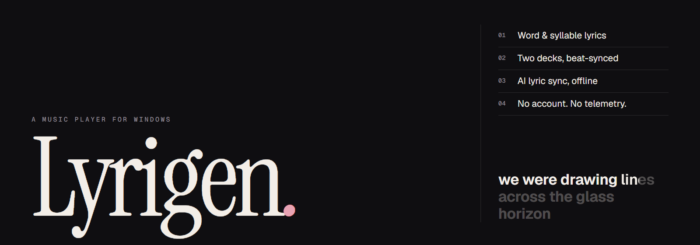
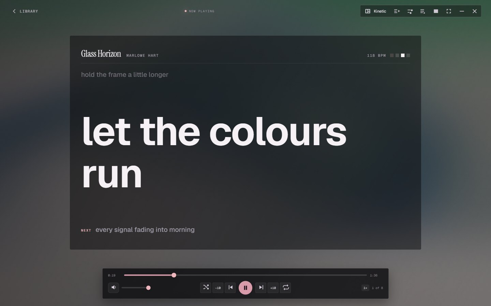

**Lyrigen** is a free music player for the songs already on your computer. Lyrics follow the voice word by word — syllable by syllable when you want karaoke — songs flow into each other like a DJ set, and nothing you play ever leaves the machine. No account, no subscription, no telemetry.

**[Download for Windows →](https://github.com/mufaddalhirani/lyrigen/releases/latest)** &nbsp;·&nbsp; version 3.0.0 &nbsp;·&nbsp; Windows 10 and 11 &nbsp;·&nbsp; companion app: [Lyric Studio](https://github.com/mufaddalhirani/lyrics-studio)


---

### 01 &nbsp;Lyrics that see the music

<table>
<tr>
<td width="62%" rowspan="2"></td>
<td></td>
</tr>
<tr>
<td></td>
</tr>
</table>

Every song's **beats** are found on your computer, so the lyrics move with the music you actually hear. In an instrumental break the lyrics hand over to live bars, a 1-2-3-4 beat counter and a **count-in** before the next line. Choose the view from the player's top bar:

- **Kinetic** — each word lands as it is sung; held notes stand out in large italic serif with a bar that fills as the note is held.
- **Balanced**, **Lyrics only**, **Cover only**, **Spinning vinyl**, **Visualizer**.
- **brat** — lime green, each word flies in from alternate sides.

The background is made from the cover — blurred, slowly moving, swelling on the kick ([Kawarp](https://github.com/better-lyrics/kawarp)) — and album art turns over with a small animation when the song changes.

### 02 &nbsp;Songs that flow like a DJ set

When a song ends, Lyrigen mixes the next one in **on the beat**: it matches the tempos (without changing the pitch), starts the next song where its beat kicks in instead of at a quiet intro, and skips the silence at the ends of songs. **Auto** picks the transition for each pair of songs — or choose one:

| Transition | What you hear |
|---|---|
| Slow blend | 32 beats: the next song rises underneath, and the basslines swap halfway |
| Bass swap | the new song comes in without bass, then takes it on the downbeat |
| Filter | the old song is muffled away while the new one opens up |
| Echo out | the old song repeats on the beat and fades as the new one lands |
| Sound trail | the old song dissolves into a reverb wash |
| Build-up & drop | a rising sweep, one beat of silence, then the new song hits |

Prefer it simple? Plain crossfades and hard cuts are one setting away. Unless you choose hard cuts, skipping a song fades it out in a blink rather than cutting it off.

### 03 &nbsp;The DJ


Two decks that find each song's **tempo and beat grid** on their own, then **sync** them — tempo and phase, half- and double-time aware — and keep them locked. Scrolling waveforms, cue and four hot cues per song, loops from ½ to 16 beats, beat roll, vinyl brake, three-band EQ with kills, a filter sweep, echo, reverb, flanger, bitcrush, and an eight-pad sampler. **Automix** blends a queue of songs on the beat; **record** your mix to an Opus file; map any USB controller with **MIDI learn**; go full-screen with party mode.

### 04 &nbsp;Lyrics, found and timed

<table>
<tr>
<td width="36%"></td>
<td></td>
</tr>
</table>

Lyrigen reads `.ttml`, `.lrc`, `.yrc` and `.txt` beside each song, and finds the rest from free sources — Better Lyrics, BiniLyrics, Unison, AMLL TTML DB and LRCLIB — keeping the **best-timed** match. Click any word to jump to it. With **[Lyric Studio](https://github.com/mufaddalhirani/lyrics-studio)** installed, *AI sync* times any song on your own computer, word by word or syllable by syllable, keeping any timing a person already made. Press **Sync syllables with AI** in the player to send the song you are listening to; the sync keeps running in the background while you carry on. Lyrics are saved beside the song and inside its tags, so other players see them too.


Also on board: a six-band EQ with presets and genre modes (remembered between sessions), dynamic leveling, pitch shift, pitch-preserving speed, centre-vocal reduction, A–B loops, a queue that plays exactly what it shows (including on shuffle), a mini player, and global media keys. The library opens instantly, even with thousands of songs.

---

## Install

1. Download **`Lyrigen.Setup.3.0.0.exe`** from [Releases](https://github.com/mufaddalhirani/lyrigen/releases/latest) — or `Lyrigen-Portable-3.0.0.exe`, a single file that runs without installing.
2. Run it. Windows may say *"Windows protected your PC"*, because the app isn't code-signed yet: choose **More info → Run anyway**.
3. Choose your music folder. Lyrigen scans everything beneath it and remembers it.

**For AI lyric sync**, install [Python 3.10+](https://www.python.org/downloads/) and [Lyric Studio](https://github.com/mufaddalhirani/lyrics-studio). **For the Downloads screen**, install yt-dlp and ffmpeg: `winget install yt-dlp.yt-dlp` and `winget install Gyan.FFmpeg`. Everything else works without them.

<details>
<summary><b>Keyboard</b></summary>

| Key | Action |
|---|---|
| `Space` | Play / pause — anywhere in the app (in DJ: the louder deck) |
| `←` / `→` | Back / forward 10 seconds (full player) |
| `M` · `S` · `R` | Mute · shuffle · repeat mode (full player) |
| `Esc` | Close a panel, or leave the full player |
| `Ctrl` + `K` | Search your library (`Esc` clears it) |
| Media keys | Play, previous, next — even in the background |
</details>

<details>
<summary><b>Library tools</b></summary>

- **Metadata Studio** — fix tags and artwork, with undo.
- **Organizer** — plans moves into `Artist\Album\` folders; nothing moves until you approve, and Undo puts it all back.
- **Lyrics Finder** — fills in missing lyrics in bulk, or lets you pick the match; AI sync lives here too.
- **Downloads** (uses your own yt-dlp) — checks a link, lets you correct artist, title and album, then tags it, adds lyrics and files it.
- **Listening** — recaps for the week, month, year or all time, kept on your computer.
</details>

## Privacy

There is no account and no telemetry. Your library, history and settings stay in your Windows user folder. The only network requests are lyric look-ups (which you can switch off in Settings) and, if you use them, the download and catalogue screens.

## Build from source

```bash
git clone https://github.com/mufaddalhirani/lyrigen.git
cd lyrigen
npm install
npm run dev        # run it while you work on the code
npm run build      # installer + portable exe in release\
```

How it fits together is in [`docs/ARCHITECTURE.md`](docs/ARCHITECTURE.md); the end-to-end checks live in [`scripts/`](scripts/).

## Use it responsibly

The Downloads screen drives [yt-dlp](https://github.com/yt-dlp/yt-dlp), which you install yourself. Only download what you have the right to — your own uploads, public-domain or Creative Commons music, or content the service's terms allow.

## Credits

Lyric rendering by [Apple Music-like Lyrics](https://github.com/Steve-xmh/applemusic-like-lyrics); fluid background by [Kawarp](https://github.com/better-lyrics/kawarp); lyrics from [Better Lyrics](https://better-lyrics.boidu.dev), [BiniLyrics](https://lyrics.binimum.org), [Unison](https://unison.boidu.dev), [AMLL TTML DB](https://github.com/Steve-xmh/amll-ttml-db) and [LRCLIB](https://lrclib.net). Type: [Instrument Serif](https://fonts.google.com/specimen/Instrument+Serif) and [Geist](https://vercel.com/font), both OFL. Icons: [Material Symbols](https://fonts.google.com/icons). Built with [Electron](https://www.electronjs.org), [React](https://react.dev) and [Vite](https://vite.dev).

The songs in the screenshots are made up; their covers are public-domain paintings and prints from [The Met's Open Access collection](https://www.metmuseum.org/about-the-met/policies-and-documents/open-access) — van Gogh, Hokusai and Seurat.
