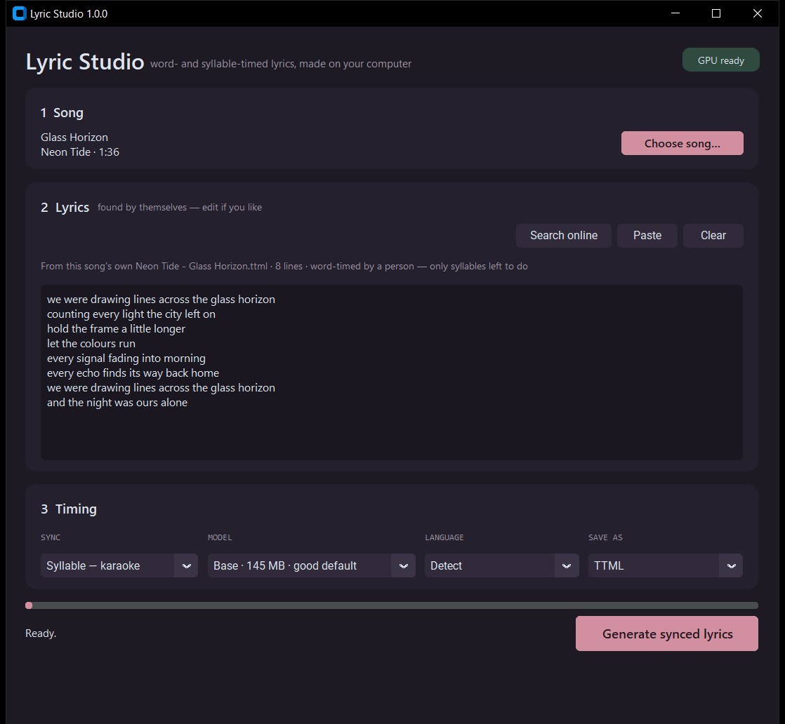

<div align="center">

# Lyric Studio

**Word- and syllable-timed lyrics, made on your own computer — for karaoke, for [Lyrigen](https://github.com/mufaddalhirani/lyrigen), or for any player that reads TTML or LRC.**

Pick a song. Its lyrics are found for you. Press **Generate**. A synced lyric file lands next to the song.
Nothing is uploaded — the AI runs locally, on your graphics card if you have one.

[](https://github.com/mufaddalhirani/lyrics-studio/archive/refs/heads/main.zip)
&nbsp;
[](https://github.com/mufaddalhirani/lyrigen)


-4a4a55)



</div>

---

## Install (Windows)

1. Install **[Python 3.10 or newer](https://www.python.org/downloads/)** — on the first screen, tick **"Add python.exe to PATH"**.
2. **[Download Lyric Studio](https://github.com/mufaddalhirani/lyrics-studio/archive/refs/heads/main.zip)** and unzip it anywhere.
3. Double-click **`install.bat`**.

"Lyric Studio" now appears in the Start menu and on the desktop.
- **NVIDIA graphics card:** the installer also adds the CUDA 12 libraries the AI needs, whatever CUDA version your system has.
- **AI models:** they download the first time you use them (Whisper *base* ≈ 145 MB, the syllable aligner ≈ 1.2 GB). After that, everything works offline.

To try it without installing, run `run.bat` from the folder (the Python packages must already be installed).

## How to use it

1. **Choose song…** The picker opens where you last were.
2. **Lyrics** appear by themselves:
   - from the song's own `.ttml` / `.lrc` / `.txt` if it has one,
   - otherwise from [BiniLyrics](https://lyrics.binimum.org), then [LRCLIB](https://lrclib.net).

   Edit them if you like, or paste your own.
3. Pick **Syllable** (karaoke) or **Word** and press **Generate synced lyrics**. The `.ttml` and/or `.lrc` is saved beside the song; an existing file is backed up first.

## What it does with each kind of lyrics

| You have… | What happens | Speed |
|---|---|---|
| Lyrics word-timed by a person (TTML) | Their timing is kept, checked against *your* recording (and shifted if it was made for a different version), and only syllables are added | fastest, most accurate |
| Line-timed lyrics (LRC) | Each line's words are placed inside that line's moment | seconds per song |
| Plain lyrics | Aligned across the whole song | pick *Small* or larger; minutes on a CPU |
| No lyrics | Whisper writes and times the words itself | depends on the model |

**The AI decides timing, never spelling:** the output always has your exact words.

**Syllables** come from Meta's MMS aligner (1,130 languages). Every syllable is romanised, and the aligner finds where each letter is sung, 20 ms at a time — so a held note stretches across its syllable in karaoke instead of splitting evenly.
- **English:** split by spoken syllables (*ri·ver*, *lit·tle*, one-syllable *jumped*).
- **Hindi and other Indic scripts:** split by akshara (*आ·शि·क़ा·ना*).
- **Japanese:** split by mora.

## Models

| Model | Size | Good for |
|---|---|---|
| Tiny | 75 MB | quick drafts |
| **Base** | 145 MB | the default — plenty with lyrics to align |
| Small | 480 MB | accents, dense mixes |
| Medium | 1.5 GB | hard songs; slow on a CPU |
| Large v3 | 3 GB | best; wants a GPU |

Downloads show their progress and resume where they stopped if interrupted.

## Command line

```
python -m lyricstudio.cli --audio "song.opus" --level syllable --find-lyrics
```

The command prints JSON events, one per line; the final `result` event includes the finished TTML and LRC. Every option is in [`lyricstudio/cli.py`](lyricstudio/cli.py). This is the interface [Lyrigen](https://github.com/mufaddalhirani/lyrigen) uses, so a file made in either app plays word by word (or syllable by syllable) in the other.

## Credits

[faster-whisper](https://github.com/SYSTRAN/faster-whisper) · [stable-ts](https://github.com/jianfch/stable-ts) · [MMS forced aligner](https://huggingface.co/MahmoudAshraf/mms-300m-1130-forced-aligner) · [uroman](https://github.com/isi-nlp/uroman) · [CustomTkinter](https://github.com/TomSchimansky/CustomTkinter) · lyrics from [BiniLyrics](https://lyrics.binimum.org) and [LRCLIB](https://lrclib.net).
